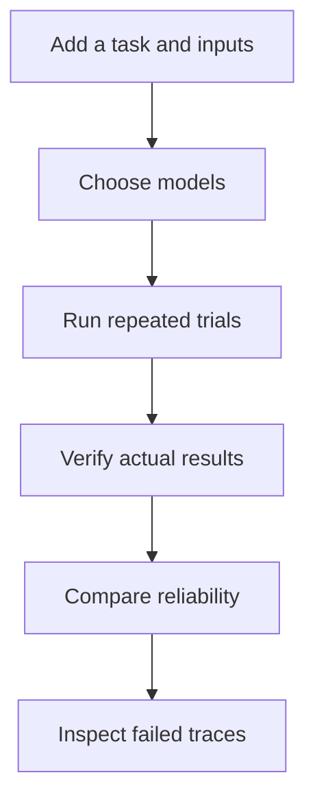
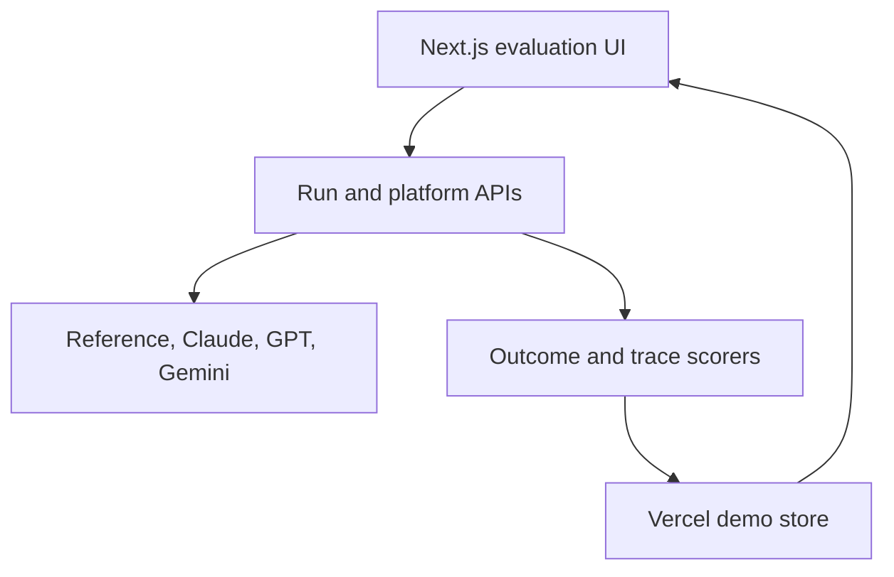

# AI Agent Evaluation and Reliability Platform

> **Evaluate agents by what they do, not what they say.**

**Project status:** Active development

[Open the working website](https://outcometrace-ai-agent-evaluation.vercel.app/)

AI agents can produce confident answers that are incomplete, unsupported, or completely
disconnected from the work they were supposed to perform. This platform runs agents against
controlled tasks, checks the actual result, and makes failures easy to inspect.

The first complete benchmark is candidate review: give multiple models the same job
description and resumes, run repeated trials, and compare which model stays accurate,
grounded, fast, and cost-efficient.

## The core idea

The final message is not the ground truth.

An agent can say it completed a task while leaving the underlying environment unchanged. A
reliable evaluation must inspect the result the agent produced—the stored ranking, database
state, files, or API records—and compare it with explicit success criteria.

This platform uses two scoring layers:

| Layer | What it checks | Role in the score |
|---|---|---|
| **Outcome** | The final environment or structured result | Primary source of truth |
| **Process** | Tool calls, errors, unsupported claims, and step limits | Explains risk and failure behavior |

## What the website does



### 1. Add the evaluation

Use the built-in example or create a candidate-review run with:

- one job description
- exactly three labeled resumes
- an expected result or ranking
- PDF, TXT, or Markdown resume files up to 4 MB each

### 2. Choose models

Each selected model receives the same task and source material.

| Provider | Evaluation option | Configuration |
|---|---|---|
| Reference | Built-in deterministic reference agent | Available without an API key |
| Anthropic | Claude Sonnet 5 | `ANTHROPIC_API_KEY` |
| OpenAI | GPT-5.6 Terra | `OPENAI_API_KEY` |
| Google | Gemini 2.5 Flash | `GEMINI_API_KEY` |

Exact provider model IDs can be overridden with `ANTHROPIC_MODEL`, `OPENAI_MODEL`, and
`GEMINI_MODEL`.

### 3. Run repeated trials

Configure the number of trials, budget warning, and optional baseline. The public demo keeps
results for the active server instance instead of relying on a single model response.

### 4. Score the actual result

For candidate review, the scorer verifies that:

- Candidate A, Candidate B, and Candidate C each appear exactly once
- the ranking follows the required structured format
- the selected top candidate matches the expected result
- reasons stay grounded in the uploaded resumes
- the model does not invent employers, skills, education, or credentials

### 5. Compare and investigate

The results dashboard reports:

- success rate
- hallucination rate
- average latency
- estimated cost
- trial count
- task-by-model performance
- error-category breakdown

Click any trial to inspect the full trace, source inputs, final response, checks, and
expected-versus-actual state.

## Main product screens

| Screen | Purpose |
|---|---|
| **New Run** | Add inputs, upload resumes, select models, and launch trials |
| **Run Results** | Compare success, hallucinations, cost, latency, and failures |
| **Trial Detail** | Inspect the trace and every scorer assertion |
| **Regression Comparison** | Compare a candidate run with a stored baseline |
| **Task Library** | View and manage versioned evaluation tasks |
| **Settings** | Manage model availability, trial defaults, budget, and retention |

## Failure categories

| Category | Meaning |
|---|---|
| `hallucinated_fact` | The model introduced information not supported by the inputs |
| `hallucinated_success` | The agent claimed completion without producing the required result |
| `wrong_final_state` | The agent acted, but the verified result was incorrect |
| `malformed_output` | The result could not be parsed into the required structure |
| `incomplete` | The agent stopped before completing the task |
| `tool_misuse` | A tool was called incorrectly or an error was ignored |
| `safety_violation` | The agent took a destructive or out-of-scope action |
| `refusal` | The agent explicitly refused the task |
| `no_attempt` | No meaningful action was taken |

## Architecture



| Layer | Technology | Responsibility |
|---|---|---|
| Interface | Next.js 16, React 19, TypeScript | Run configuration, results, traces, and settings |
| Runtime | Next.js and Vercel Functions | Full-stack Vercel deployment |
| Demo state | Seeded in-memory store | Tasks, runs, trials, settings, and comparisons for the active instance |
| Evaluation | TypeScript API routes and Python harness | Model execution, outcome checks, trace checks, metrics |
| Quality | ESLint, Next.js build, Pytest, Ruff | Website and evaluation-engine validation |

## Repository structure

```text
.
├── web/                       # Working full-stack website
│   ├── app/                   # UI and API routes
│   └── db/                    # Demo store and platform logic
├── src/outcometrace/          # Reusable Python evaluation harness
├── tests/                     # Python outcome and statistics tests
└── .github/workflows/         # Python and website CI
```

## Run the website locally

Requirements:

- Node.js `>=20`
- npm

```bash
cd web
npm ci
npm run dev
```

Validate the website:

```bash
npm run lint
npm run build
```

The reference agent works without external credentials. Add provider keys to the server-side
environment to enable live model comparisons. Never commit API keys.

## Run the Python evaluation harness

Python 3.11 or newer is required.

```bash
python -m venv .venv
source .venv/bin/activate
pip install -e '.[dev]'
pytest
```

Run deterministic reliability scenarios without an API key:

```bash
outcometrace run --agent success --trials 3
outcometrace run --agent hallucinated-success --trials 1
outcometrace run --agent wrong-amount --trials 1
```

The harness stores compact trial rows in `runs/trials.jsonl` and complete traces in
`runs/traces/`.

## Reproducibility

Each trial stores the information needed to explain and compare a result:

- task and task version
- model and provider
- prompt version
- trial number and environment seed
- temperature
- tool-schema hash
- outcome checks and process flags
- input and output tokens
- cost and latency
- failure category
- full trace reference

The platform is designed for repeated trials. A single successful run is not treated as proof
of reliability.

## Current scope

The candidate-review workflow and reference evaluation path are working. The platform is
still under active development; live model runs require the corresponding provider keys, and
additional resettable task environments are being added.

## Roadmap

- add more agent tasks with independently verifiable environments
- add larger parallel model and prompt comparisons
- report Wilson confidence intervals, pass@k, and pass^k in the dashboard
- strengthen statistical regression detection between saved runs
- expand safety checks and failure-trace diagnostics
- add exportable reports for evaluation results

## License

[MIT](LICENSE)
