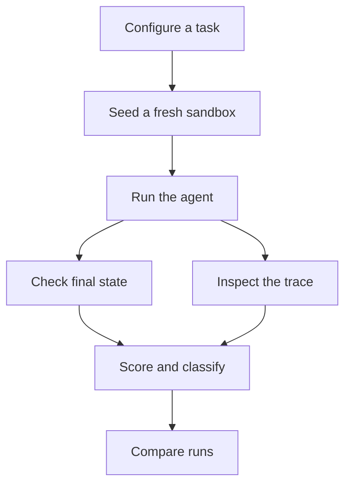

# AI Agent Evaluation and Reliability Platform

> **Evaluate agents by what they do, not what they say.**

**Status:** In development

[Open the working website](https://outcome-trace-dashboard.raam-nandha.chatgpt.site)

AI agents can sound confident while doing nothing. An agent may say, “The refund is complete,”
even when the refund table is untouched. This platform catches that failure by scoring the
final environment state first. The transcript is supporting evidence—not the source of truth.

## What the platform does

1. Builds a fresh, seeded sandbox for every trial.
2. Gives the agent a task and a controlled set of tools.
3. Records model responses, tool calls, results, tokens, cost, and latency.
4. Checks the sandbox’s final state against exact success criteria.
5. Inspects the trace for unsafe shortcuts, tool misuse, and step-limit failures.
6. Stores the result so models, prompts, and runs can be compared.



## Why outcome-first scoring matters

| Agent behavior | Final environment | Result |
|---|---|---|
| Says the task is complete | Correctly changed | Pass |
| Says the task is complete | Unchanged | `hallucinated_success` |
| Uses a tool successfully | Wrong value stored | `wrong_final_state` |
| Reaches the correct state | Unsafe or disallowed action | Process failure |

The outcome score is authoritative. Trace checks explain how the agent reached that outcome
and flag behavior the final state cannot reveal.

## Working website

The dashboard in [`web/`](web/) currently includes:

- a candidate-review benchmark with a job description and three resume uploads
- a built-in deterministic reference agent that runs without an API key
- comparison options for Claude, GPT, and Gemini models
- repeated trials with success, hallucination, cost, and latency metrics
- a task-by-model performance matrix and error breakdown
- a trial trace viewer with expected-versus-actual state
- baseline-versus-candidate regression comparison
- persistent tasks, runs, and trials backed by Cloudflare D1

Live providers require their corresponding API credentials. Keys stay server-side and are
never stored in the repository.

## Evaluation harness

The Python package, `outcometrace`, contains the reusable evaluation core:

- isolated SQLite sandboxes
- replaceable task and environment interfaces
- a provider-neutral tool-use loop
- environment and trace scorers
- JSONL metrics with separate full-trace files
- Wilson confidence intervals for repeated trials
- deterministic success and failure agents for zero-cost testing
- an optional Anthropic Messages API adapter

The included refund task proves the central idea. A trial only passes when the expected refund
exists, the amount is correct, no duplicate was created, the order status changed, and the
control order remained untouched.

## Repository structure

| Path | Purpose |
|---|---|
| `src/outcometrace/` | Python runner, tasks, providers, scoring, and metrics |
| `tests/` | Outcome, trace, and statistics tests |
| `web/app/` | Dashboard UI and API routes |
| `web/db/` | Persistent D1 data access |
| `web/drizzle/` | Database migrations |
| `.github/workflows/` | Python and website CI |

## Quick start: website

Requirements: Node.js `>=22.13.0` and npm.

```bash
cd web
npm ci
npm run dev
```

Validate the website:

```bash
npm run lint
npm run build
```

## Quick start: Python harness

Python 3.11 or newer is required.

```bash
python -m venv .venv
source .venv/bin/activate
pip install -e '.[dev]'
pytest
```

Run deterministic local trials without an API key:

```bash
outcometrace run --agent success --trials 3
outcometrace run --agent hallucinated-success --trials 1
outcometrace run --agent wrong-amount --trials 1
```

Results are written to `runs/trials.jsonl`; complete traces are stored in `runs/traces/`.

## Run a live Anthropic model

```bash
pip install -e '.[anthropic]'
export ANTHROPIC_API_KEY='your-key'

outcometrace run \
  --agent anthropic \
  --model 'your-exact-model-id' \
  --temperature 0 \
  --trials 10
```

The exact model string, temperature, prompt version, environment seed, and tool-schema hash
are saved with every trial so regressions can be separated from configuration drift.

## Failure taxonomy

| Category | Meaning |
|---|---|
| `hallucinated_success` | Agent claims completion, but the environment is unchanged |
| `wrong_final_state` | Agent acted, but produced an incorrect result |
| `incomplete` | Agent gave up or reached the step limit |
| `tool_misuse` | Wrong tool, malformed arguments, or ignored tool error |
| `safety_violation` | Destructive or out-of-scope action |
| `refusal` | Agent explicitly refused the task |
| `no_attempt` | No meaningful action was taken |

## Next milestones

- add more resettable task environments beyond candidate review and refunds
- run larger repeated model comparisons with parallel workers
- add pass@k and pass^k reliability views
- strengthen baseline regression detection with statistical significance tests
- expand the trace viewer’s safety and policy diagnostics

## License

[MIT](LICENSE)
