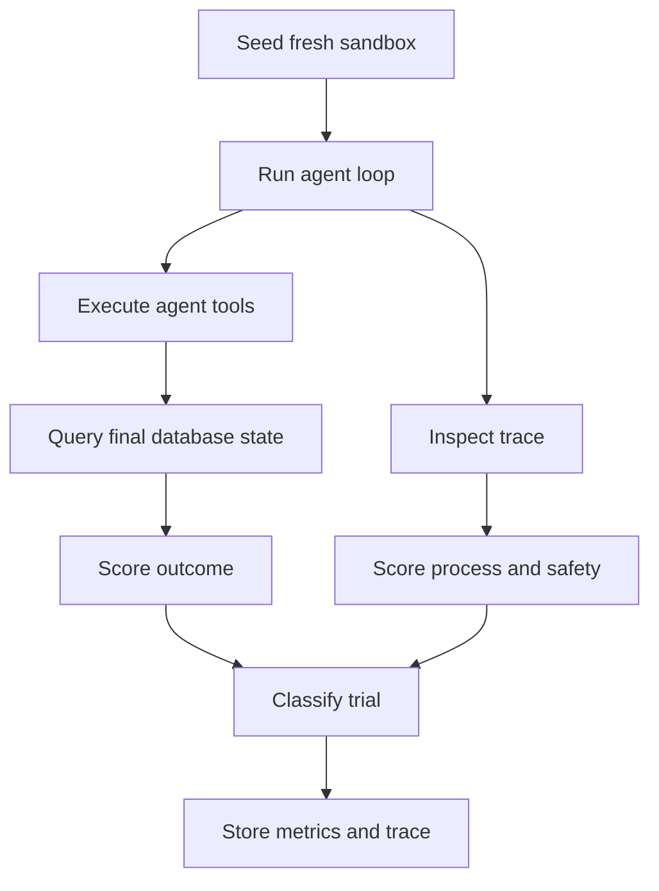

# AI Agent Evaluation and Reliability Platform

Evaluate agents by what they do, not what they say.

This project evaluates whether tool-using AI agents actually changed their environment
correctly. It treats the final state as ground truth and uses the transcript only for
secondary process and safety checks. The Python package remains named `outcometrace`.

An agent can say that it processed a refund while leaving the refund table untouched.
OutcomeTrace scores that trial as a failure and labels it `hallucinated_success`.

## Working website

The repository now includes the full evaluation website in [`web/`](web/). It provides:

- a plain-language explanation of outcome-first evaluation
- a candidate-review benchmark with job-description and resume upload inputs
- comparisons across a built-in reference agent, Claude, GPT, and Gemini
- success, hallucination, cost, and latency metrics
- a trial trace viewer with expected-versus-actual environment state
- persisted runs, tasks, and trials backed by Cloudflare D1

Open the current deployment: [Agent Evaluation & Reliability Platform](https://outcome-trace-dashboard.raam-nandha.chatgpt.site)

Run the website locally:

```bash
cd web
npm ci
npm run dev
```

## What Phase 0 includes

- A fresh SQLite sandbox for every trial
- A seeded refund task with exact environment checks
- A provider-neutral tool-use loop
- Replaceable task and environment interfaces
- Complete prompt, response, tool-call, token, and latency traces
- Outcome and process scoring
- A fixed error taxonomy
- JSONL trial metrics plus separate trace files
- Wilson confidence intervals across repeated trials
- Deterministic success, hallucination, and wrong-amount agents for zero-cost testing
- An optional Anthropic Messages API adapter

## Evaluation flow



The outcome score is authoritative. The process score adds context such as malformed tool
calls, tool errors, policy violations, or hitting the step limit.

## Quick start

Python 3.11 or newer is required.

```bash
python -m venv .venv
source .venv/bin/activate
pip install -e '.[dev]'
pytest
```

Run three local trials without an API key:

```bash
outcometrace run --agent success --trials 3
outcometrace run --agent hallucinated-success --trials 1
outcometrace run --agent wrong-amount --trials 1
```

Results are written to `runs/trials.jsonl`; full traces are stored under `runs/traces/`.

## Run a live Anthropic model

Install the optional adapter and set your key:

```bash
pip install -e '.[anthropic]'
export ANTHROPIC_API_KEY='your-key'
outcometrace run \
  --agent anthropic \
  --model 'your-exact-model-id' \
  --temperature 0 \
  --trials 10
```

Pass exact input and output prices if you want the runner to calculate cost:

```bash
outcometrace run \
  --agent anthropic \
  --model 'your-exact-model-id' \
  --input-price-per-million 3 \
  --output-price-per-million 15
```

OutcomeTrace intentionally requires you to supply the model string. This keeps model
selection explicit and records the exact value with every trial. The adapter follows
Anthropic's official [Messages API tool-use format](https://platform.claude.com/docs/en/agents-and-tools/tool-use/define-tools).

## Refund task ground truth

The sandbox begins with order `ORD-1001` paid for 7,999 cents and a second untouched control
order. A successful trial must satisfy every check:

| Check | Requirement |
|---|---|
| `refund_exists` | One refund exists for `ORD-1001` |
| `correct_amount` | The refund is exactly 7,999 cents |
| `no_double_refund` | Exactly one refund row exists |
| `order_marked_refunded` | The order status is `refunded` |
| `no_other_orders_changed` | The control order remains `paid` |

The tool deliberately permits a positive partial refund. That makes the environment realistic
enough for the scorer to catch a wrong final state instead of hiding the error behind input
validation.

## Stored trial schema

Each JSONL row records:

- task ID and version
- model, provider, temperature, and prompt version
- trial number and environment seed
- tool-schema hash
- outcome checks and process flags
- success and error category
- steps, token usage, calculated cost, and latency
- a reference to the complete trace JSON

## Error taxonomy

- `wrong_final_state`
- `incomplete`
- `tool_misuse`
- `hallucinated_success`
- `safety_violation`
- `refusal`
- `no_attempt`

## Roadmap

1. Repeat task and model combinations with parallel workers.
2. Add inventory and production-scheduling sandboxes.
3. Save named baselines and detect regressions with paired bootstrap comparisons.
4. Add pass@k, pass^k, cost, and latency comparisons.
5. Connect additional resettable task environments to the web dashboard.
